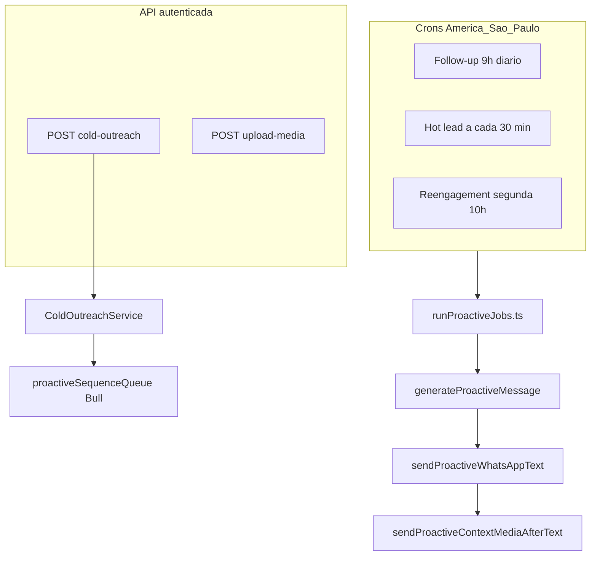

# Mapa da proatividade do agente (`agent_proactive`) e lacunas

Documento de auditoria: o que existe, onde é lido, e o que falta para cobertura operacional “100%” (produto + engenharia).

## Fluxo resumido

| Entrada | Arquivo | Notas |
|--------|---------|--------|
| Crons | [`jobs/AgentProactiveJobs.ts`](../src/jobs/AgentProactiveJobs.ts) | Inicialização no boot do servidor |
| Follow-up / Hot / Reengagement | [`runProactiveJobs.ts`](../src/services/AgentProactiveServices/runProactiveJobs.ts) | Usa `loadProactiveSettings` |
| Cold outreach | [`AgentProactiveController.ts`](../src/controllers/AgentProactiveController.ts) → [`ColdOutreachService.ts`](../src/services/AgentProactiveServices/ColdOutreachService.ts) | HTTP 202, processamento em background |
| Upload mídia | [`AgentProactiveController.postUploadProactiveMedia`](../src/controllers/AgentProactiveController.ts) | Path público `/company{id}/agent-proactive/...` |
| Sequência pós–cold | [`proactiveSequenceQueue.ts`](../src/services/AgentProactiveServices/proactiveSequenceQueue.ts) | Registrado em [`queues.ts`](../src/queues.ts) |

## Gate `enabled` (master)

| Caminho | Exige `agent_proactive.enabled === true`? |
|---------|-------------------------------------------|
| Crons (`runFollowUpJob`, `runHotLeadJob`, `runReengagementJob`) | **Sim** — `loadProactiveSettings` retorna `null` se `!s.enabled` |
| `sendColdOutreach` | **Sim** — aborta com log se `!settings.enabled` |
| Upload de mídia | **Não** — apenas autenticação/perfil |

**Implicação:** cold outreach e crons ficam alinhados ao master; upload continua permitido com master off (útil para preparar mídia, mas pode confundir na UI).

## Settings → consumidores

Tipos em [`types/agentProactiveSettings.ts`](../src/types/agentProactiveSettings.ts).

| Campo / grupo | Onde é usado (principal) |
|---------------|---------------------------|
| `enabled` | `loadProactiveSettings`, `ColdOutreachService` |
| `followUpEnabled`, `followUpAfterDays`, `maxFollowUpAttempts`, `minHoursBetweenFollowUps` | `runFollowUpJob` |
| `hotLeadEnabled`, `hotLeadKeywords`, `useHotLeadButtons` | `runHotLeadJob`, `generateProactiveMessage` / envio |
| `reengagementEnabled`, `reengageAfterWeeks`, `maxReengagementAttempts` | `runReengagementJob` |
| `hints`, `objectives`, `playbook`, `proactiveMission`, `customProactiveText` | `generateProactiveMessage` |
| `segments`, `applySegmentFilters`, `businessHours`, `maxProactivePerContactPerDay` | `passesProactiveGuards`, `proactiveSegmentFilter`, `proactiveBusinessHours`, `proactiveDailyLimit` |
| `mediaByContext` | `sendProactiveContextMediaAfterText`, texto via `beforeMediaContext` em `proactiveOpenAi` |
| `sequences.cold_outreach` | `ColdOutreachService`, `proactiveSequenceQueue` |
| `coldOutreachBlendMode` | Apenas front + API de resolução de IDs (blend no controller) |
| `defaultOutbound`, `openAiVisionInbound`, `acknowledgeMedia` | Fluxo reativo / mídia recebida (integração), não os crons |

## Estado no ticket (`dataWebhook.agentProactive`)

Persistido via [`agentProactiveTicketState.ts`](../src/services/AgentProactiveServices/agentProactiveTicketState.ts): tentativas de follow-up, reengajamento, inativo, contadores diários, etc.

`proactiveSalesStage` existe no tipo para funil explícito — **nenhum job do core preenche automaticamente** hoje.

## Pré-requisitos operacionais (checklist)

1. **WhatsApp** conectado e canal capaz de enviar mensagens do bot.
2. **`agent_proactive.enabled`** ligado para crons e cold outreach.
3. **OpenAI** / integração ativa para mensagens geradas por IA (exceto quando `customProactiveText` preenche o contexto).
4. **Horário comercial** (se `businessHours.enabled`): janela America/São Paulo.
5. **Contato** sem `disableBot` (quando aplicável).
6. **Ticket** elegível — ver `ticketEligibleForProactiveAi` e filtros de status/fila.

## Lacunas e melhorias priorizadas (para “100%”)

| Prioridade | Lacuna | Sugestão |
|------------|--------|----------|
| P1 | Follow-up não é “exatamente 24h depois” | Job roda 1×/dia às 9h; combina `followUpAfterDays` + `minHoursBetweenFollowUps`. UI/docs devem deixar isso explícito ou evoluir para job mais frequente / agendamento por ticket. |
| P1 | Master off vs upload de mídia | Opcional: bloquear upload se `!enabled` ou aviso forte na UI. |
| P2 | Paridade multi-canal | Envio proativo documentado como WhatsApp-heavy; outros conectores podem precisar mesmo pipeline. |
| P2 | Observabilidade | Logs existem; falta UI admin “último proativo por ticket” ou métricas para suporte. |
| P2 | Testes automatizados | Poucos testes em `passesProactiveGuards`, segmento, sequência — risco de regressão. |
| P3 | Funil por estágio | `proactiveSalesStage` sem automação; regras diferentes por estágio = nova feature. |
| P3 | Missão vendas/suporte na conversa reativa | `proactiveMission` afeta só mensagens **proativas** (jobs/API), não cada resposta do chat — continua responsabilidade do Cargo/prompt. |

## Documentos relacionados

- Runbook comercial: [`runbook-fluxo-vendas-agente.md`](./runbook-fluxo-vendas-agente.md)
